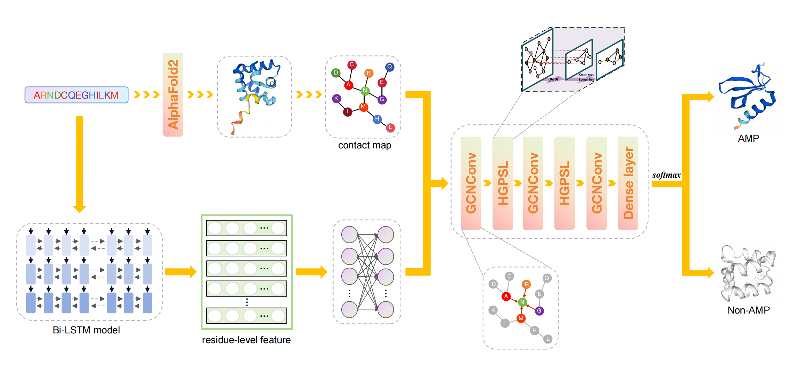

# deepAMPNet
The implementation of deepAMPNet for identification of antimicrobial peptides.
<p align="center">
	 
</p>
### Dependencies<br>
* Python 3.7.0<br>
* torch 1.13.1<br>
* torch-cluster 1.6.0<br>
* torch-scatter 2.0.9<br>
* torch-sparse 0.6.15<br>
* torch-geometric 2.3.1<br>
* scikit-learn 1.0.2<br>
* biopython 1.81<br>
* h5py 3.8.0<br>
* numpy 1.21.6<br>
* pandas 1.3.5<br>
More detailed python libraries used in this project are referred to `requirements.txt`, install the pytorch and pyG (torch-cluster, torch-scatter, torch-sparse, torch-geometric) according to your CUDA version.<br>
### Datasets<br>
Datasets for training and testing can be constructed using the method shown in 	`example/example.sh`, you are required to initially download the pre-trained Bi-LSTM protein language model from [here](http://bergerlab-downloads.csail.mit.edu/prose/saved_models.zip) and stored it in folder `Bi_LSTM_model`.The model we used is called `prose_mt_3x1024.sav`.<br>
```
python ../encode_AA.py -i example.fasta -o example.h5 -n 6165 -d -1<br>
python ../dataset_h5.py --pdb example_pdb --label AMPs.txt --h5 example.h5 --threshold 20 --root dataset_example<br>
```
### Train<br>
